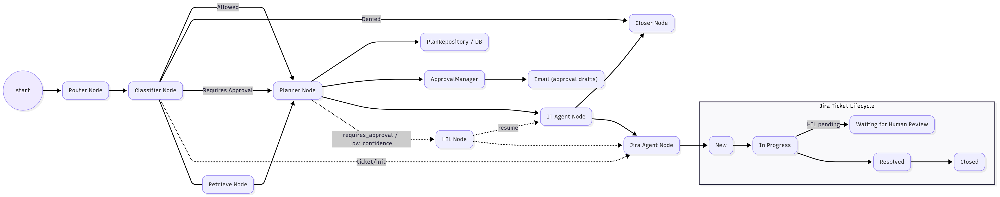

# Local IT Support

A local IT support system with AI capabilities built using LangGraph, LangChain, and FastAPI.

## Features

- AI-powered IT support using local LLMs (Ollama)
- JIRA integration for ticket management
- Email notifications via SMTP
- Document processing and analysis
- Vector database for knowledge management
- RESTful API with FastAPI

## Quick Start

### Prerequisites

- Python 3.9+
- Poetry (recommended) or pip
- Ollama (for local LLM)

### Installation

1. **Clone the repository**
   ```bash
   git clone https://github.com/MayssaHH/Chimera_Agentic_IT_Support.git
   cd local-it-support
   ```

2. **Install dependencies**
   ```bash
   poetry install
   ```

3. **Set up environment variables**
   ```bash
   cp .env.example .env
   # Edit .env with your actual values
   ```

4. **Start Ollama (if using local LLM)**
   ```bash
   ollama serve
   ```

### Running the Application

**Development mode (with auto-reload):**
```bash
make dev
```

**Production mode:**
```bash
make run
```


### Testing

```bash
make test
```

### Available Make Commands

- `make help` - Show all available commands
- `make install` - Install dependencies with Poetry
- `make dev` - Run development server
- `make test` - Run tests
- `make run` - Run production server
- `make clean` - Clean cache files
- `make format` - Format code
- `make lint` - Run linting checks

## Configuration

The following environment variables need to be configured in your `.env` file:

- **JIRA**: Base URL, username, and API token
- **SMTP**: Host, port, username, password for email notifications
- **Ollama**: Base URL for local LLM
- **Database**: Connection string (defaults to SQLite)
- **API**: Host, port, and debug settings

## Project Structure

```
local-it-support/
├── src/                  # Source code
│   ├── graph/           # Workflow graph components
│   │   ├── nodes/       # Graph execution nodes
│   │   │   ├── it_agent.py      # IT Agent execution node
│   │   │   ├── classifier.py    # Request classification
│   │   │   ├── router.py        # Model routing
│   │   │   ├── jira_agent.py    # JIRA integration
│   │   │   └── ...              # Other nodes
│   │   └── state.py     # State management
│   ├── tools/           # External service integrations
│   │   ├── emailer.py   # Email functionality
│   │   ├── jira.py      # JIRA API client
│   │   └── ...          # Other tools
│   └── prompts/         # LLM prompt templates
├── tests/                # Test files
├── pyproject.toml        # Poetry configuration
├── Makefile             # Build and run commands
├── .env.example         # Environment variables template
└── README.md            # This file
```

## IT Agent Node

The IT Agent node (`src/graph/nodes/it_agent.py`) is responsible for executing what is executable from the execution plan and returning the appropriate outcome status.

### Features

- **Automated Execution**: Executes steps that can be automated using available tools
- **Email Integration**: Sends approval emails and notifications via SMTP
- **JIRA Integration**: Updates ticket fields and adds comments
- **User Guide Generation**: Creates step-by-step instructions for manual steps
- **Outcome Classification**: Returns one of three possible outcomes:
  - `executed`: All steps completed automatically
  - `awaiting_employee`: Employee action required
  - `awaiting_manager`: Manager approval required

### Usage

```python
from src.graph.nodes.it_agent import it_agent_node, ExecutionOutcome

# Execute the IT agent
result_state = it_agent_node(workflow_state)

# Check the outcome
outcome = result_state["it_outcome"]
if outcome == ExecutionOutcome.AWAITING_EMPLOYEE:
    # Handle employee action required
    user_guide = result_state.get("user_guide")
elif outcome == ExecutionOutcome.AWAITING_MANAGER:
    # Handle manager approval required
    pass
else:
    # All steps executed successfully
    execution_results = result_state.get("execution_results", [])
```

### Execution Flow

1. **Plan Analysis**: Analyzes the execution plan to identify executable vs. manual steps
2. **Tool Execution**: Uses appropriate tools (email, JIRA, system) to execute automated steps
3. **User Guide Creation**: Generates comprehensive user guides for manual steps
4. **Status Updates**: Updates ticket status based on remaining actions
5. **Outcome Determination**: Returns the appropriate execution outcome

## API Endpoints

Once running, the API will be available at `http://localhost:8000`

- `/docs` - Interactive API documentation (Swagger UI)
- `/redoc` - Alternative API documentation

## Contributing

1. Fork the repository
2. Create a feature branch
3. Make your changes
4. Run tests: `make test`
5. Format code: `make format`
6. Submit a pull request



## License

[Your License Here]
